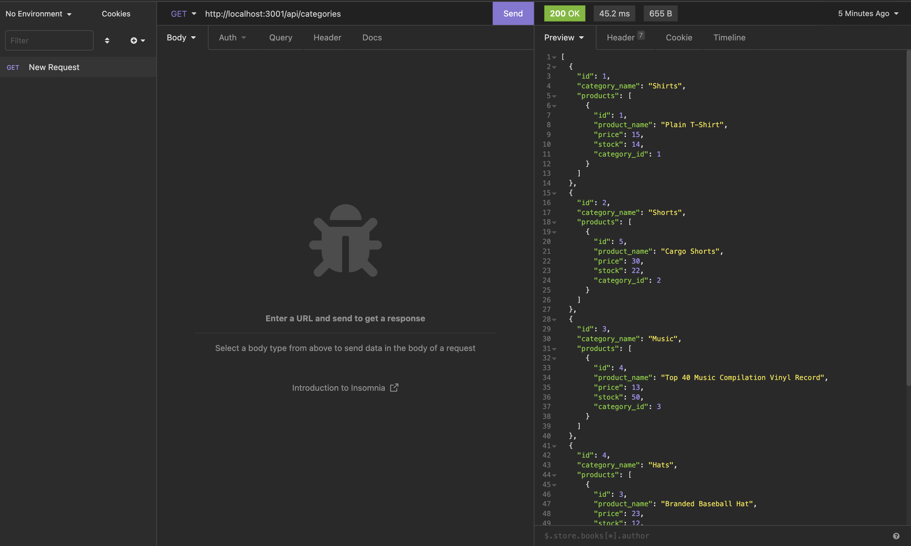
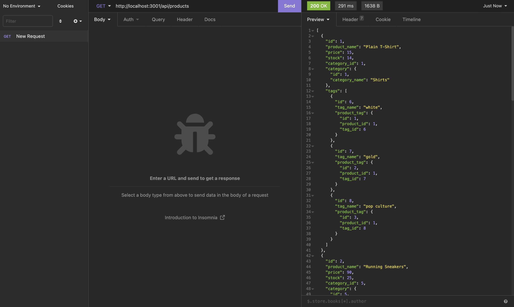
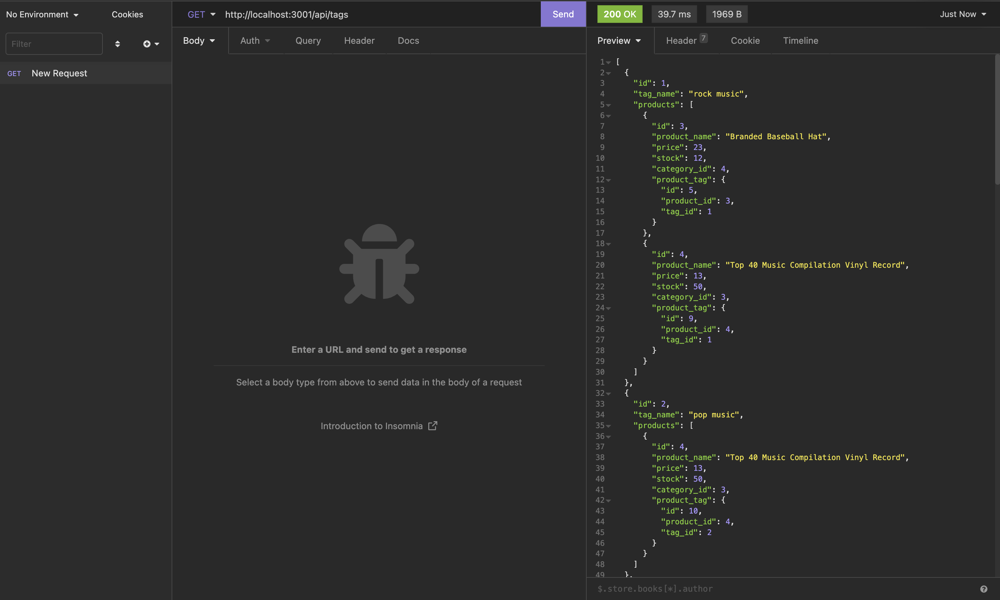

# e-Commerce-Back-end

This is an Back-end app of a MySQL database where you can access in (insomnia, postman, local webpage, etc...)

# Table of Contents

# Video

[Click here](https://drive.google.com/file/d/17FPJgLGtGNvR-PJLocCCNUbclHFt5JZf/view?usp=sharing) for the demo video

# Install

_You will need MySQL and Node.js install for this app to work_

[Click Here](https://github.com/Drewpayton/e-Commerce-Back-end) for github repo

After you clone the repo you will run the following: 

`npm i`

The line above will install the dependecies that you'll need, next create a `.env` file and put in the following:

`DB_NAME=ecommerce_db`

`DB_PW=`

`DB_USER=`

You will enter the code above in your `.env` file and fill the PW with your password and USER with you mysql , next you will log into your MySQL and run the following code:

`SOURCE db/schema.sql`

The code above will download the create the database for you, then you want to log out of your MySQL and in your terminal you'll run the following: 

`node seeds/index.js`

The code above will run all the seeds and insert the data into your database, then you will run the following:

`npm start`

# Screenshots

Screenshot of categories data

Screenshot of products

Screenshot of tags

# Technology Used

I used MySQL, Node.js, mysql2, sequalize, express

# Questions / Contact

Any questions please contact me @ [drewpayton18@gmail.com](mailto:drewpayton18@gmail.com)

contacts:

* [Github](https://github.com/Drewpayton)
* [Linkedin](https://www.linkedin.com/in/drewpayton2018/)
* [Portfolio](https://drewpayton.github.io/personal-portfolio/)

